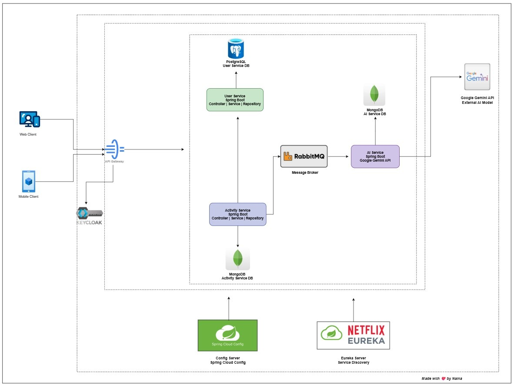

# 🏋️ Fitness Microservices Platform

A **production-style microservices application** for tracking fitness activities and generating **AI-powered workout recommendations**, built using **Spring Boot, Spring Cloud, and React**.

This project demonstrates real-world backend engineering concepts including **OAuth2 security**, **API Gateway**, **event-driven architecture**, and **polyglot persistence**.

---

## 🚀 Why This Project

- Designed to mirror **real enterprise microservices**
- Focus on **security, scalability, and clean architecture**
- Uses industry-standard tools used in production systems
- Built as a **portfolio project** to showcase backend & full-stack skills

---

## 🧠 Key Features

- 🔐 Secure authentication using **Keycloak (OAuth2 + PKCE)**
- 🚪 **API Gateway** with centralized routing & JWT validation
- 🧭 Service discovery with **Netflix Eureka**
- ⚙️ Centralized configuration via **Spring Cloud Config Server**
- 📡 Event-driven communication using **RabbitMQ**
- 🏃 Activity tracking (Running, Walking, Cycling)
- 🤖 AI-powered recommendations using **Gemini API**
- 🗄️ Polyglot persistence (**PostgreSQL + MongoDB**)
- 🐳 Docker-based local setup

---

## 🛠️ Tech Stack

**Backend**
- Java 21, Spring Boot, Spring Cloud
- Spring Security, Spring WebFlux
- Spring Data JPA, Spring Data MongoDB

**Frontend**
- React, Redux Toolkit
- Axios, Material UI

**Infrastructure**
- Keycloak, RabbitMQ
- PostgreSQL, MongoDB
- Eureka, Config Server
- Docker

**AI**
- Gemini API

---

## 🏗️ Architecture Overview

- All requests flow through **API Gateway**
- Authentication handled by **Keycloak**
- Services register with **Eureka**
- Configurations loaded from **Config Server**
- Activity events published to **RabbitMQ**
- AI Service consumes events and generates recommendations

📌 *Architecture diagram included in the repository*


---

## 📁 Project Structure

```text
fitness-microservice/
│
├── gatewayservice/           # API Gateway & Security
├── userservice/              # User Management (PostgreSQL)
├── activityservice/          # Activity Tracking (MongoDB)
├── aiservice/                # AI Recommendations
├── configserver/             # Centralized Config
├── eureka/                   # Service Discovery
└── fitness-app-frontend/     # React Frontend
```

## 🗄️ Database Schema

### User Service (PostgreSQL)

- Users
- Keycloak User Mapping
- User Metadata

### Activity Service (MongoDB)

```text
{
"id": "string",
"userId": UUID,
"type": "RUNNING | WALKING | CYCLING",
"duration": number,
"caloriesBurned": number,
"startTime":timestamp,
"additionalMetrics": {},
"createdAt": "timestamp",
"updatedAt": "timestamp"
}
```

### AI Service (MongoDB)

```text
{
"id": "string",
"activityId":"string",
"userId": UUID,
"activityType": "RUNNING | WALKING | CYCLING",
"recommendation":"string",
"improvements":{},
"suggestions":{},
"safety":{},
"createdAt": "timestamp"
}
```
---
## 📦 Features

- 🔐 Secure authentication with Keycloak (OAuth2 + PKCE)
- 🚪 API Gateway with centralized routing and security
- 👤 Automatic user synchronization from Keycloak
- 🏃 Activity tracking (Running, Walking, Cycling)
- 🤖 AI-based activity recommendations
- 📡 Event-driven architecture using RabbitMQ
- 🧭 Service discovery with Eureka
- ⚙️ Centralized configuration using Config Server

---
## 🌐 REST API Endpoints

### Gateway (Entry Point)

```text
http://localhost:8080
```

### User Service

| Method | Endpoint                   | Description             |
|--------|----------------------------|-------------------------|
| GET    | `/api/users/{userId}`      | Get user details        |
| GET    | `/api/users/{id}/validate` | Validate user existence |
| POST   | `/api/users`               | Register new user       |

### Activity Service

| Method | Endpoint                       | Description                                      |
|--------|--------------------------------|--------------------------------------------------|
| GET    | `/api/activities`              | Fetch all activities for the authenticated user  |
| GET    | `/api/activities/{activityId}` | Fetch a specific activity by its ID              |
| POST   | `/api/activities`              | Create a new activity for the authenticated user |

### AI Recommendation Service

| Method | Endpoint                                     | Description                                   |
|--------|----------------------------------------------|-----------------------------------------------|
| GET    | `/api/recommendations/user/{userId}`         | Get AI recommendations for a specific user    |
| GET    | `/api/recommendations/activity/{activityId}` | Get AI recommendation for a specific activity |

---
## Service Method Summary

### Gateway Service
- JWT extraction and validation
- User auto-registration using KeycloakUserSyncFilter
- Request enrichment with X-User-ID header

### User Service
- User persistence
- Validation APIs
- Keycloak user mapping

### Activity Service
- Activity operations
- Publishes activity events to RabbitMQ

### AI Service
- Listens to activity events
- Calls Gemini API
- Stores AI-generated recommendations

---
## 🧼 Code Formatting

This project uses:

- `google-java-format`

---
## ▶️ Running the Application

### Start Infrastructure
- PostgreSQL
- MongoDB
- RabbitMQ
- Keycloak
- Eureka Server
- Config Server

### Start Services (Recommended Order)
- Config Server
- Eureka Server
- User Service
- Activity Service
- AI Service
- Gateway Service

### Start Frontend
- npm install
- npm run dev

---
## 👤 Author
**Naina Sharma**  
Software Engineer

[LinkedIn: naina-sharma](https://www.linkedin.com/in/naina-sharma-67318a220)